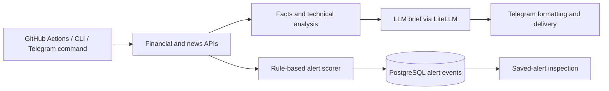
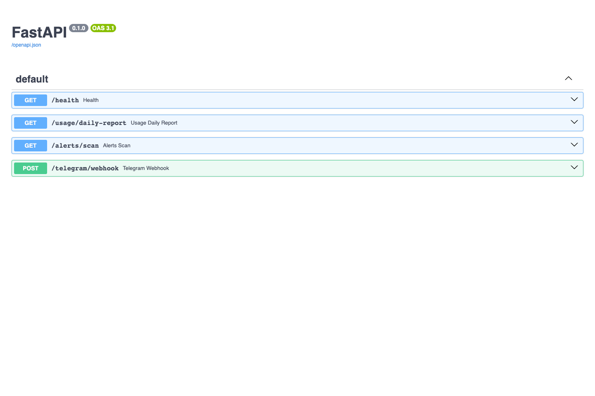

# Market Intelligence

A Python service and CLI that collect stock/crypto market data, generate LLM-assisted briefs and deliver information through a Telegram bot. Built to explore scheduled data workflows, API integration, explainable alert scoring and model-usage tracking.

**Operational status — 4 October 2026:** Daily Brief and Daily Usage Report workflows are enabled. The hourly **Alerts Scan is paused** because its backing PostgreSQL database needs restoration. Database-dependent watchlists, settings and saved alerts should not be treated as fully operational. There is no public bot/demo account.

> For information only, not financial advice. Automated briefs and alerts can be wrong or stale; verify data and sources independently.

## Two separate processing paths



Briefs use yfinance, Finnhub and crypto-data integrations, with LiteLLM calling configured OpenAI models. The alert scorer uses explicit terms, source weights and watchlist matches; an LLM does not determine alert impact scores. Scans normalize and deduplicate events before persistence.

FastAPI exposes the Telegram webhook, health endpoint and scheduled task endpoints. Bot commands include `/brief`, `/why`, `/levels`, `/tech`, `/alerts` and per-chat watchlist/settings management. Allow-listed chats restrict bot use; modifying group settings requires an admin check. PostgreSQL storage uses psycopg and hand-written SQL. YAML watchlists provide the fallback when no database is configured.

The package separates [`data`](src/data), [`analysis`](src/analysis), [`ai`](src/ai), [`alerts`](src/alerts), [`storage`](src/storage), [`delivery`](src/delivery) and [`web`](src/web). Usage logging records model token counts and estimated cost.

## Inspect locally

```bash
python3 -m venv .venv
source .venv/bin/activate
pip install -r requirements-dev.txt
cp .env.example .env
python main.py --help
uvicorn src.web.app:app --host 127.0.0.1 --port 8000
```

Open `http://127.0.0.1:8000/docs` to inspect the API, or `/health` for a local health check. A health response does not validate database connectivity or delivery.



This screenshot is the actual API documentation, not a market dashboard or evidence of a running alert schedule. A sanitized Telegram brief capture is still missing; no chat history or invented Telegram UI is included. [Capture notes](docs/media/README.md).

For data/LLM commands, fill the relevant API keys in `.env`:

```bash
python main.py brief
python main.py levels BTC
```

The `levels` command needs market data but does not call the LLM. `python main.py brief --send-telegram` additionally requires your own `TELEGRAM_BOT_TOKEN` and `TELEGRAM_CHAT_ID`, and sends a real message.

## Hosting and schedules

- Daily Brief runs through GitHub Actions at 01:00 UTC. Configure repository secrets for OpenAI, Finnhub and Telegram before enabling it in your own deployment.
- Alerts Scan and the usage-report task call the FastAPI service with `Authorization: Bearer <token>`. Configure the service and corresponding workflow secrets from [.env.example](.env.example).
- Set `ALLOWED_CHAT_IDS` and `TELEGRAM_WEBHOOK_SECRET`, then register the Telegram webhook with the same `secret_token`. The secret-header check is enforced only when that environment variable is configured.
- To resume Alerts Scan, restore PostgreSQL, update `DATABASE_URL`, validate a manual scan, then enable the workflow. Do not infer service readiness from the enabled daily brief: that path does not use PostgreSQL.

## Test evidence and limitations

**78 pytest tests passed locally on 4 October 2026.** They cover alert scoring/scanning, watchlists, settings, command parsing, Telegram formatting, webhook and endpoint authentication, news resilience and safe LLM error responses.

```bash
python -m pytest -q
```

The suite mocks external dependencies; live financial feeds, bot delivery and the restored database need separate integration validation. API availability/rate limits and LLM summaries affect reliability. A deprecated query-token compatibility path remains alongside bearer authentication. Preferred per-chat brief times are stored settings, not independent per-chat schedulers. This is an information/automation project, with no order-execution functionality.
